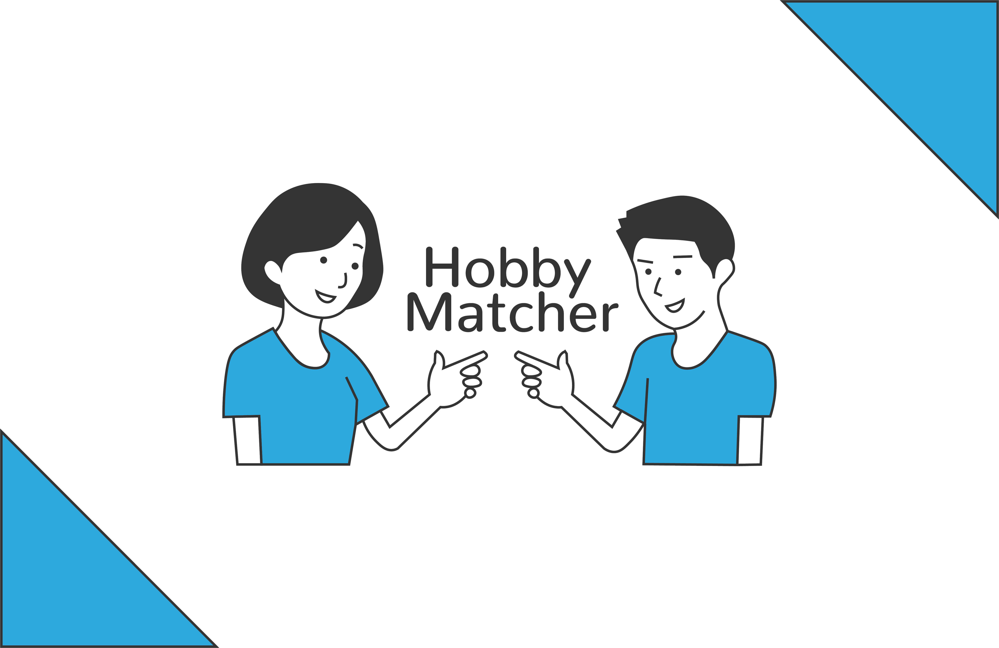

# HobbyMatcher

<section>
  
  
  
  
</section>

## What is HobbyMatcher?
HobbyMatcher is a matching app made for a school project. This is a project I’m working on while studying at the Amsterdam University of Applied Sciences, for a course called Project Tech. If you want more information about this project and the process, you can check out my [wiki](https://github.com/Bram-ter/blok-tech/wiki).

## Installing this project
To install this project you need NPM and Node

After cloning this repo to a local place you run:
`npm install`

## License
This project uses a MIT license, you can read more about it in the [License](./LICENSE).

